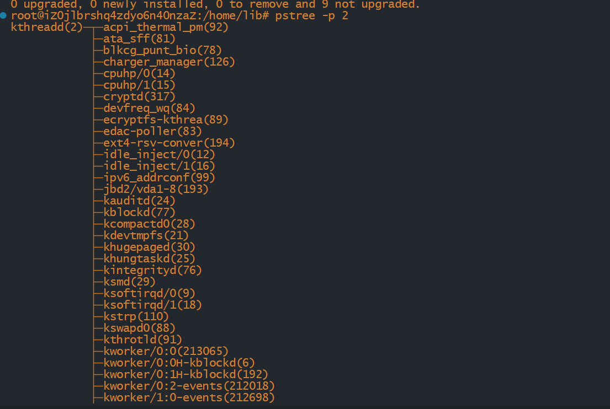
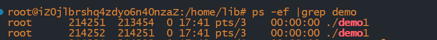
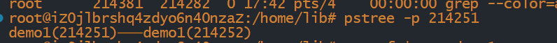

# 进程的创建

整个`Linux`系统全部的进程是一个树状结构

`0号进程(系统进程)`：所有进程的祖先，创建了1号进程与2号进程

`1号进程(systemd)`:负责执行内核的初始化工作与继续系统配置

`2号进程(kthreadd)`：负责所有内核线程的调度与管理

我们可以使用`pstree`命令来查看进程树，命令为：

~~~shell
pstree -p 进程编号
~~~

示例：

## 进程标识

每一个进程的有一个非负整数标识的唯一的进程ID，虽然是唯一，但是我们可以复用进程ID，当一个进程终止以后，该进程ID自然就成为了复用的候选者，但Linux本身采用的是延迟服用算法，让新建进程的ID不同于最近计数进程的ID，防止被误以为进程尚未终止

~~~cpp
pid_t getpid(void) //获取当前进程的ID
pid_t getppid(void) //获取父进程的ID
~~~

说明：

`pid_t`:非负整数

## fork函数

### fork 函数的使用

一个现有的进程能够调用fork()函数去创建一个新的进程

~~~cpp
pid_t fork(void);
~~~

由`fork()`创建的进程叫做子进程，下面演示一个例子：

~~~cpp
//demo1.cpp
#include <iostream>
#include<unistd.h>

using namespace std;

int main()
{
    fork();
    cout<<"hello world"<<endl;
    sleep(100);
    cout<<"over";
    return 0;
}
~~~

我们可以使用命令来查看一下它的进程

~~~shell
ps -ef |grep demo1
~~~

我们用上面的查看进程树命令来试一下：

~~~shell
pstree -p 214251
~~~

我们可以看到它创建了一个子进程

### 分割子进程与父进程

`fork()`会返回值,而子进程与父进程的返回值不同，示例代码如下：

~~~cpp
#include <iostream>
#include <unistd.h>

using namespace std;

int main()
{
    fork();
    int pid=fork();
    cout<<pid<<endl;
}
~~~

输出结果：

我们可以发现：

子进程的返回值：0

父进程的返回值：父进程的进程ID

所以我们可以通过这个来选择父进程与子进程所执行的代码

示例代码：

~~~cpp
#include <iostream>
#include <unistd.h>

using namespace std;

int main()
{
    int pid = fork();
    if(pid==0)  cout<<"现在执行的是子进程"<<endl;
    if(pid>0)  cout<<"现在执行的是父进程"<<endl;
}
~~~

输出结果：

#### 子进程与父进程之间的关系

在子进程被创建之后，它与父进程之间并不是共享堆栈以及数据空间的而是子进程获得了父进程的数据空间以及堆栈的副本

### fork()的两种用法

1. 父进程复制自己，然后父进程与子进程分别执行不同的代码，多见于网络服务程序，父进程等待客户端的连接请求，当请求到达的时候，父进程调用`fork()`，让子进程处理请求，而父进程等待下一个连接请求
2. 进程需要执行另一个程序，这种多见于shell中，让子进程去执行exec族函数

### 共享文件

`fork()`的一个特性是在父进程中打开的文件描述符都会被复制到子进程中，父进程与子进程共享一个文件偏移量（子进程所写的内容会在父进程所写内容的后面）

 **注意**：如果父进程与子进程写同一描述符指向的文件，但是每一然后显示的同步，那么它们的输出可能相互混合

### vfork()函数

`vfork()`函数的调用与`fork`函数相同，但两者的语义不同

`vfork()`函数用于创建一个新进程，而新进程的目的是`exec`一个新程序，由于我们要求子进程必须立即执行，所以它不复制父进程的地址空间

`vfork()`与`fork()`的另一个区别：`vfork()`保证子进程先执行,保证了子进程调用`exec`函数或`exit()`之后父进程才恢复执行.
