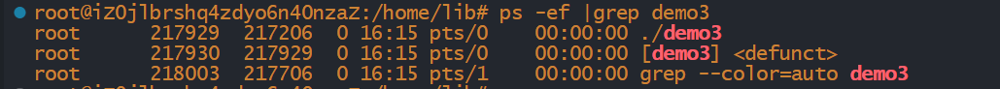
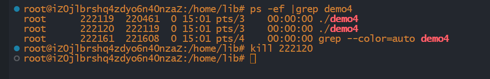
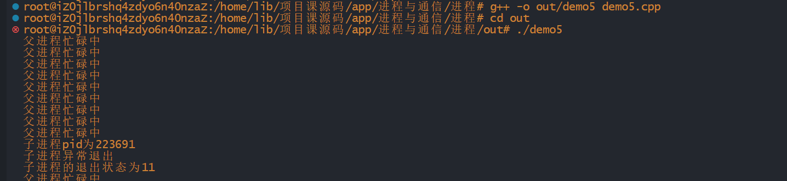

# 僵尸进程

## 前言

如果父进程比子进程先退出，子进程将被1号进程所托管(这是一种让进程在后台运行的方法)，而如果子进程比父进程先退出，且父进程并没有处理子进程退出的信息的话，那么子进程将成为僵尸进程.

代码示例：

~~~cpp
#include <iostream>
#include <unistd.h>

using namespace std;

int main()
{
    if(fork()==0) return 0;
    for(int i=0;i<1000;i++)
    {
        cout<<"hello world"<<endl;
        sleep(100);
    }
    return 0;
}
~~~

我们可以看到哪怕子进程已经退出了，但是我们查找进程的时候，子进程依旧存在，这时候它就成为了一个僵尸进程。

## 僵尸进程的危害

`Linux`内核给每一个子进程都保留了一个数据结构，它包括了进程编号，终止状态，使用`cpu`时间等等。当父进程处理了子进程的退出之后内核会将这个数据结构释放掉，而父进程如果没有将子进程的退出处理掉，内核就不会释放这个数据结构，这样会导致子进程的基础编号一直被占用，而进程编号的数量是有限的，这样将影响系统去创建新的进程

## 如何避免僵尸进程

- 子进程退出的时候，内核需要向父进程发出`SIGCHLD`信号，如果父进程用`signal(SIGCHLD,SIG_INT)`来表示对子进程的退出不做处理，内核将自动释放子进程的数据结构

- 父进程通过`wait/waitpid`函数等待子进程结束，子进程退出前，父进程将被阻塞

  ~~~cpp
   pid_t wait(int *stat_loc);
   pid_t waitpid(pid_t pid, int *stat_loc, int options);
   pid_t wait3(int *stat_loc, int options, struct rusage *rusage);
   pid_t wait4(pid_t pid, int *stat_loc, int options, struct rusage *rusage);
  ~~~

  返回值是子进程的编号

  **变量的说明**：

  - `pid_t pid`：要等待的进程的进程ID。
  - `int *stat_loc`：用于保存进程退出状态的指针。如果不关心进程的退出状态，可以传递 `NULL`。
  - `int options`：等待选项，可用于指定等待行为的一些附加选项。常见的选项包括 `WNOHANG` （非阻塞等待）和 `WUNTRACED` （等待暂停子进程状态）。
  - `struct rusage *rusage`：用于保存子进程资源使用情况的结构体指针。如果不关心子进程的资源使用情况，可以传递 `NULL`。
  - `stzt_loc`是子进程终止的信息，如果是正常终止，宏`WIFEEXITED(stat_loc)`返回真，`WEXITSTAUTS(stat_loc)`可获取终止状态，如果是异常状态，宏`WTERMSIG`可获取终止进程的信号

  我们来用一段代码实验一下上述知识点：

  ~~~cpp
  #include <iostream>
  #include<unistd.h>
  #include <sys/types.h>
  #include <sys/wait.h>
  
  using namespace std;
  
  int main()
  {
      //父进程
     if(fork()>0)
     {
          int sts;
          pid_t pid=wait(&sts);
          cout<<"已经终止子进程的进程编号为:"<<pid<<endl;
          if(WIFEXITED(sts))
          {
              cout<<"子进程正常退出"<<"子进程的退出状态为"<<WEXITSTATUS(sts)<<endl;
          }
          else
          {
              cout<<"子进程异常退出"<<"子进程的退出状态为"<<WTERMSIG(sts)<<endl;
          }   
     }
     //子进程
     else
     {
          sleep(30);
          cout<<"byebye"<<endl;
          exit(1);
     }
  }
  ~~~

我们如果尝试使用kill指令去强行结束子进程：

- 如果父进程很忙，我们可以考虑捕获`SIGCHLD`信号，在信号处理函数里面调用`wait()/waitpid()`

  代码示例：

  ~~~cpp
  #include <iostream>
  #include <unistd.h>
  #include<sys/types.h>
  #include<sys/wait.h>
  
  using namespace std;
  
  void  func(int signal)
  {
      int sts;
      pid_t pid=wait(&sts);
      cout<<"子进程pid为"<<pid<<endl;
      if(WIFEXITED(sts))
      {
          cout<<"子进程正常退出\n"<<"子进程的退出状态为"<<WEXITSTATUS(sts)<<endl;
      }
      else
      { 
          cout<<"子进程异常退出\n"<<"子进程的退出状态为"<<WTERMSIG(sts)<<endl;
      }   
  }
  int main()
  {
      signal(SIGCHLD,func);
      if(fork()>0)
      {
          while(true)
          {
              sleep(1);
              cout<<"父进程忙碌中"<<endl;
          }
      }
      else
      {
          sleep(10);
          int *p=0;
          *p=10;
          exit(1);
      }
  }
  ~~~

