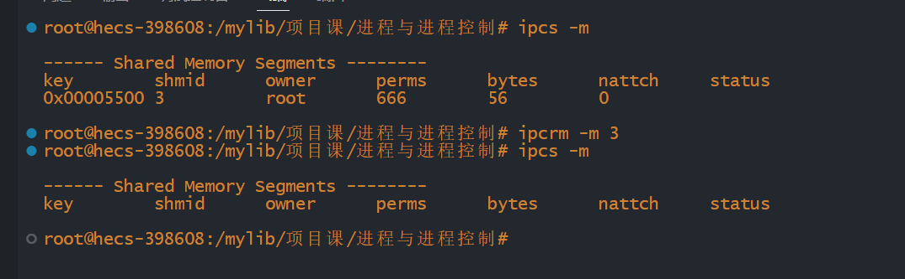

# 共享内存

## 前言

多线程之间共享进程的地址空间，所以如果多个线程需要访问同一块内存的话，使用全局变量即可

而在多进程中，我们上面也说到每个进程之间往往地址空间都是独立的，不共享的，如果多个进程需要访问同一块内存，这个时候是不能使用全局变量的，只能使用共享内存

共享内存允许多个进程(并不要求进程与进程之间有血缘关系)访问同一块内存空间，这是多个进程之间共享与传送数据最高效的方式.进程可以将共享内存链接到它们自己的内存空间中，如果某个进程修改了共享内存中的数据，其他的进程所读取到的数据也会改变。

共享内存没有提供锁机制，这意味着，在某一个进程对共享内存进行读/写的时候，不会阻止其他进程对其的读/写，如果要对共享内存的读/写加锁，可以使用信号量。

### shmget函数

`shmget()`函数用于创建/获取共享内存

函数形式：

~~~cpp
int shmget(key_t key,size_t size, int shmflg)
~~~

注释：

`key`:共享内存的键值，是一个整数，一般采取16进制，不同共享内存的key不能相同

`size`：共享内存的大小

`shmflg`：共享内存的访问权限，与文件权限一样

代码示例

~~~cpp
//创建/获取共享内存
    int shmid=shmget(0x5500,sizeof(gril),IPC_CREAT|0666);
    if(shmid==-1)
    {
        cout<<"shmget(0x5500) failed"<<endl;
    }
    cout<<"shmid="<<shmid<<endl;
    return 0;
~~~

输出为：

我们可以尝试查看系统当前的共享内存

我们也可以删除共享内存

### shmat函数

我们可以提供`shmat()`函数来将共享内存链接到当前进程的地址空间

函数形式：

~~~cpp
void* shmat(int shmid,const void *shmaddr,int shmflg);
~~~

注释：

`shmid`:由`shmget()`返回的共享空间标识

`shmaddr`：指定共享内存连接到当前进程的具体位置，一般填0，表示让系统来选择共享内存的地址。

`shmflg`:标志位，一般填0

### shmdt函数

如果我们想将共享内存从当前进程中分离，相当于`shmat()`函数的反操作

函数形式：

~~~cpp
int shmdt(const void *shmaddr)
~~~

`shmaddr`:shmat()函数返回的地址。

### shmctl函数

我们一般会使用`shmctl()`函数来操作共享内存，最常见的就是删除共享内存

~~~cpp
int shmctl(int shmid,int command,struct shmid_ds *buf)
~~~

注释：

`command`:操作共享内存的命令

`buf`：操作共享内存的数据结构的地址

### 综合示例

~~~cpp
#include <iostream>
#include<cstdio>
#include<cstring>
#include<unistd.h>
#include<sys/ipc.h>
#include<sys/shm.h>

using namespace std;

struct gril
{
    int no; //编号;
    char name[50];//姓名

};

int main(int argc,char* argv[])
{
    //创建/获取共享内存
    int shmid=shmget(0x5500,sizeof(gril),IPC_CREAT|0666);
    if(shmid==-1)
    {
        cout<<"shmget(0x5500) failed"<<endl;
    }
    cout<<"shmid="<<shmid<<endl;

    //连接共享内存到当前进程的地址空间
    gril *gril_ptr=(gril*)shmat(shmid,0,0);
    if(gril_ptr==(void*)-1)
    {
        cout<<"shmat() failed"<<endl; 
    }

    //对共享内存进行读写
    cout<<"原值 gril_ptr->no="<<gril_ptr->no<<endl;
    cout<<"原值 gril_ptr->name="<<gril_ptr->name<<endl;
    gril_ptr->no=atoi(argv[1]);
    strcpy(gril_ptr->name,argv[2]);
    cout<<"修改后的值 gril_ptr->no="<<gril_ptr->no<<endl;
    cout<<"修改后的值 gril_ptr->name="<<gril_ptr->name<<endl;

    //断开连接
    shmdt(gril_ptr);

    //删除共享内存  
    if(shmctl(shmid,IPC_RMID,0)==-1)
    {
        cout<<"shmctl(IPC_RMID) failed"<<endl;
    }

    return 0;
}
~~~
