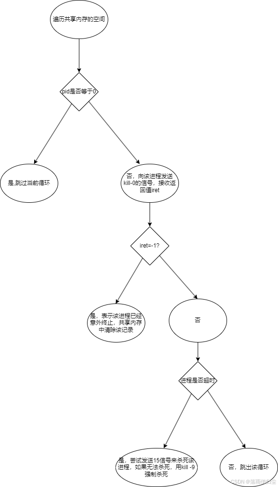

# 守护进程

## 前言

在前面我们已经实现过调度模块和进程的心跳模块了，而今天我们要讲的是作为服务端后台服务程序运行三个通用模块的最后一项:进程的守护模块，在开始讲解进程的守护模块之前我们首先来看究竟什么是进程的守护模块：

守护模块（有时也称为守护进程或守护服务）可以是软件架构的一部分，用于确保关键进程的稳定运行和系统的整体健壮性。

守护模块的主要职责可能包括但不限于：

1. 进程监控：定期检查进程的状态，确认它们是否正在运行且运行正常。
2. 异常恢复：如果检测到进程已停止或进入不稳定状态，守护模块可以采取行动，比如重启进程，以恢复服务的正常运行。
3. 资源管理：管理进程的资源使用情况，例如内存和 CPU 使用率，防止资源耗尽。
4. 日志记录和报警：记录进程的状态变化和异常情况，必要时发送警告给系统管理员。
5. 配置更新：当系统配置发生变化时，守护模块可以负责更新相关进程的配置，并重启进程以应用新的设置。
6. 安全和访问控制：确保进程在安全的环境中运行，限制对外部的访问，防止未授权的操作。

接下来我们来看一下，如何来实现一个简单的进程守护模块。

## 进程守护模块的初步实现

首先我们来看一下如何初步实现一个简单的进程守护模块，实现的流程图如下：


然后我们就可以着手来实现这个守护模块：

1.打开日志文件
    这里我们选择将日志文件名作为命令行参数输入，所以这里的实现可以向下面这样：

```cpp
 clogfile logfile;
        if (logfile.open(argv[1])==false)
        {
            cout<<"log.open"<<argv[1]<<"failed."<<endl;
        }
```

**备注**:这里的的`clogfile`类是博主自己封装的，大家可以根据自己的代码进行修改

2.创建/获取共享内存

```cpp
int shmid=shmget((key_t)SHMKEYP, MAXNUM*sizeof(struct st_procinfo), 0666|IPC_CREAT);
if(shmid==-1)
{
   logfile.write("shmget failed.");
}
```

3.将共享内存连接到当下进程的地址空间

```cpp
struct st_procinfo *st_info=(struct st_procinfo *)shmat(shmid,0,0);
if(st_info==(void *)-1)
{
 logfile.write("shmat failed.");
}
```

4.遍历共享内存,将超时的进程进行处理

```cpp
for(int i=0;i<MAXNUM;i++)
{
 if(st_info[i].pid>0)
    {
     logfile.write("checkproc pid=%d,name=%s,timeout=%d,atime=%d",st_info[i].pid,st_info[i].name,st_info[i].timeout,st_info[i].atime); //主要用于测试
        time_t now_time=time(NULL);
        if(st_info[i].timeout<=now_time-st_info[i].atime)
        {
          logfile.write("%d号进程超时，终止。",st_info[i].pid);
          kill(st_info[i].pid,9);
        }
   }
}
```

5.将共享内存分离出进程

```cpp
shmdt(st_info);
```

最后就有我们初步的进程守护模块的代码了：

```cpp
#include "../../public/_public.h"

using namespace idc;

int main(int argc,char* argv[])
{
    if(argc!=2)
    {
        printf("\n");
        printf("Using:./checkproc logfilename\n");

        printf("Example:/root/mylib/project/tools/bin/procctl 10 /root/mylib/project/tools/bin/checkproc /tmp/log/checkproc.log\n\n");

        printf("本程序用于检查后台服务程序是否超时，如果已超时，就终止它。\n");
        printf("注意：\n");
        printf("  1）本程序由procctl启动，运行周期建议为10秒。\n");
        printf("  2）为了避免被普通用户误杀，本程序应该用root用户启动。\n");
        printf("  3）如果要停止本程序，只能用killall -9 终止。\n\n\n");
    }

        // 打开日志文件
        clogfile logfile;
        if (logfile.open(argv[1])==false)
        {
            cout<<"log.open"<<argv[1]<<"failed."<<endl;
        }

        //创建/获取共享内存
        int shmid=shmget((key_t)SHMKEYP, MAXNUM*sizeof(struct st_procinfo), 0666|IPC_CREAT);
        if(shmid==-1)
        {
            logfile.write("shmget failed.");
        }

        //将共享内存连接到进程空间
        struct st_procinfo *st_info=(struct st_procinfo *)shmat(shmid,0,0);
        if(st_info==(void *)-1)
        {
            logfile.write("shmat failed.");
        }

        //检查共享内存的进程是否超时
        for(int i=0;i<MAXNUM;i++)
        {
            if(st_info[i].pid>0)
            {
                logfile.write("checkproc pid=%d,name=%s,timeout=%d,atime=%d",st_info[i].pid,st_info[i].name,st_info[i].timeout,st_info[i].atime); //主要用于测试
                time_t now_time=time(NULL);
                if(st_info[i].timeout<=now_time-st_info[i].atime)
                {
                    logfile.write("%d号进程超时，终止。",st_info[i].pid);
                    kill(st_info[i].pid,15);
                }
            }
        }

        //断开共享内存的连接
        shmdt(st_info);
        return 0;
}
```

## 代码的进一步优化

上面我们只是完成了一个简单的进程守护模块，但是其实不足之处还是比较多的，接下来我们可以看看我们还可以如何来优化一下这个代码，其实主要还是对检查共享内存的进程是否超时的代码逻辑进行一个优化，我们可以根据这个流程图来看一下我们有哪些地方没有考虑到：


根据上面的流程,我们可以得到改进后的代码：

```cpp
//检查共享内存的进程是否超时
for(int i=0;i<MAXNUM;i++)
{
    if(st_info[i].pid==0) continue;
    if(st_info[i].pid>0)
    {
    //logfile.write("checkproc pid=%d,name=%s,timeout=%d,atime=%d",st_info[i].pid,st_info[i].name,st_info[i].timeout,st_info[i].atime); //主要用于测试
    //向该进程发送信号0，测试进程是否存在
    int iret=kill(st_info[i].pid,0);
    if(iret==-1)
    {
        //进程不存在,在共享内存中删除该进程的记录
        memset(&st_info[i],0,sizeof(struct st_procinfo));
        continue;
    }
    //尝试检查进程是否超时
    time_t now_time=time(0);
    if(now_time-st_info[i].atime<st_info[i].timeout) continue;
    logfile.write("进程%d超时，准备终止",st_info[i].pid);
    struct st_procinfo tmp=st_info[i]; //备份进程信息
    kill(tmp.pid,15); //首先尝试正常终止进程
    for(int j=0;j<5;j++)
    {
        int iret=kill(tmp.pid,0);
        if(iret==-1)
        {
            logfile.write("进程%d正常终止成功",tmp.pid);
            continue; //进程不存在，说明已经正常终止;
        }
        sleep(1); //等待1秒
    }

        //进程仍然存在，说明进程没有正常终止，强制终止
        kill(tmp.pid,9);
        memset(&st_info[i],0,sizeof(struct st_procinfo));
        logfile.write("进程%d强制终止成功",tmp.pid);
    }
}
```

**拓展**：这里有一个问题，为什么这里我们要 写`struct st_procinfo tmp=st_info[i]; //备份进程信息`，主要是因为在

```cpp
for(int j=0;j<5;j++)
{
    int iret=kill(tmp.pid,0);
    if(iret==-1)
    {
        logfile.write("进程%d正常终止成功",tmp.pid);
        continue; //进程不存在，说明已经正常终止;
    }
        sleep(1); //等待1秒
    }
```

如果在这段代码执行间隔中进程被终止，信息清零，那么后面的`kill -0`和`kill -9`都是发给它自己，会造成守护模块被`kill -9`自己杀死自己的乌龙

## 结语

以上就是一个简单的守护模块的全部实现细节，下篇见!
