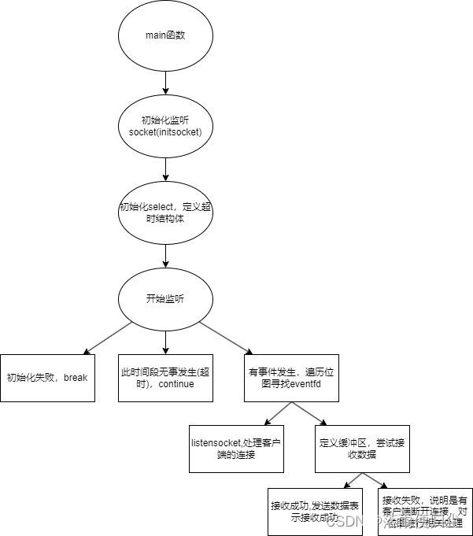

# IO多路复用 —— select

## 什么是IO多路复用

### 前言

我们在Linux上服务端一般是要同时连接多个客户端进行通信，但是为每一个客户端连接创建一个进/线程，会消耗很多资源，一个`1核2GB`的虚拟机，大概只能创建100多个线程，但是我们经常使用网络知道,这样是远远不能满足我们日常的使用需求的，所以为了解决这一问题，就需要我们去使用IO多路复用。

### IO多路复用

`IO多路复用`指的是我们可以使用一个进/线程去处理多个TCP链接，减少系统开销，而我们常见的IO多路复用主要用三种：

- select(1024)
- poll(几千)
- epoll(百万)

## 网络通讯中的读与写事件

### 读事件

- 已连接队列中有已经准备好的socket(有新的客户端连接上来)
- 接收缓存有数据可以读(对端发送的报文已经送达)
- tcp连接断开(对端使用close()函数断开了连接)

### 写事件

- 发送端缓冲区没有满，可以写入数据(向对端发送报文)

## select模型

### 位图

- 什么是位图

  select实现IO多路复用是基于位图来实现的，位图的本质是一个32位整型数组(int[32]),一个32位整型有4个字节，每个字节有8个位:
  $$
  32*8*4=1024
  $$
  每一个位可以监听一个socket这也是select模型课件监听1024个socket的原因所在。

- 位图的相关操作

  在Linux内核中为我们提供相关的宏让我们操作位图：

  ```CPP
  void D_CLR(int fd,fd_set* set);//将socket从位图中删除
  int FD_ISSET(int fd,fd_set *set);//判断socket是否在位图中
  void FD_SET(int fd,fd_set* set);//将socket加入到位图中
  void FD_ZERO(fd_set* set); //将位图全部初始化为0
  ```

### select模型的细节

写事件

- 如果`tcp`的发送缓冲区没有满，那么此时socket连接是可写的
- 一般来说发送缓冲区不容易填满，但是如果发送数据量过大或者网络带宽不够，发送缓冲区有填满的可能。

水平触发

- select()监视的socket如果发生了事件，select()会返回(通知应用程序处理事件)，如果事件没有被处理，再次调用select()的时候会立即再通知
- 存在的问题
  - 这里操作位图的方法是轮询，它的性能会随着socket的增多而降低
  - 每次调用select，需要拷贝位图，**而且select属于用户态，网络通信属于内核态，需要拷贝两次**，会影响select的性能
  - 受位图大小的限制，每个进/线程selectt所能处理的socket数量默认是1024个，性能不够高，无法处理网络通信频繁的实际场景

### select模型监控socket通讯流程图



### 代码示例

```cpp
#include "data-sharing-center/public/_cmpublic.h"
#include <string.h>

using namespace std;

int inintserver(int port); //初始化监听端口

int main(int argc,char* argv[])
{
    if(argc!=2)
    {
        cout<<"using example:./server [port]"<<endl;
        return -1;
    }

    //初始化服务端用来监听的socket
    int listensock=inintsocket(atoi(argv[1]));
    if(listensock<0)
    {
        perror("inintsocket() error");
        return -1;
    }
    cout<<"listensock="<<listensock<<endl;

    //初始化select
    fd_set readfds;
    FD_ZERO(&readfds);
    FD_SET(listensock,&readfds);

    int maxfd=listensock;//记录当前监听socket的数量

    while(true)  //使用select循环监听
    {
        //定义超时结构体
        struct timeval timeout;  //定义超时结构体
        timeout.tv_sec=10; //秒
        timeout.tv_usec=0; //微妙

        fd_set tmps=readfds;  //select操作中会对位图进行修改，创建一个临时位图

        int infds=select(maxfd+1,&tmps,NULL,NULL,&timeout);  //开启监听
        if(infds<0)   //连接失败
        {
            perror("select() error");
            break;
        }
        else if(infds==0)  //超时(此时间段没有事件发生)
        {
            cout<<"select timeout"<<endl;
            continue;
        }

        else    //有事件发生
        {
            //遍历位图，查看是哪一个socket发生事件
            for(int eventfd=0;eventfd<=maxfd;eventfd++)
            {
                if(FD_ISSET(eventfd,&tmps))    //查看是否是该socket
                {
                    if(eventfd=listensock)   //如果是监听,说明发生的事件是有客户顿socket发送了连接请求
                    {
                        //接收客户端连接
                        struct sockaddr_in clientaddr;
                        socklen_t addrlen=sizeof(clientaddr);
                        int clientsock=accept(listensock,(struct sockaddr*)&clientaddr,&addrlen);
                        if(clientsock<0)
                        {
                            perror("accept() error");
                            continue;
                        }
                        cout<<"client connected,clientsock:"<<clientsock<<endl;

                        //将新的客户端socket加入位图
                        FD_SET(clientsock,&readfds);
                        if(clientsock>maxfd)
                        {
                            maxfd=clientsock;
                        }
                    }
                    else   //否则就是客户端向服务端发送了数据，或者有客户端断开了连接
                    {
                        char buffer[1024]; //用来接收数据
                        memset(buffer,0,sizeof(buffer));
                        if(recv(eventfd,buffer,sizeof(buffer),0)<0)   //说明是有客户端断开了
                        {
                            cout<<"client disconnected,clientfd="<<eventfd<<endl;
                            close(eventfd);
                            FD_CLR(eventfd,&tmps);
                            if(maxfd==eventfd);  //重新计算maxfd的值，注意，只有当eventfd==maxfd时才需要计算。
                            {
                                for(int ii=maxfd;ii>0;ii--)
                                {
                                    if(FD_ISSET(ii,&readfds))
                                    {
                                        maxfd=ii;
                                        break;
                                    }
                                }
                            }
                        }
                        else   //说明是有客户端发送了数据
                        {
                            cout<<"client data:"<<buffer<<endl;
                            send(eventfd,buffer,strlen(buffer),0);  //把数据发送回去说明已经收到了
                        }
                    }   
                }
            }

        }
    }
    return 0;
}

int inintsocket(int port)
{
    int sock=socket(AF_INET,SOCK_STREAM,0);
    if(sock<0)
    {
        perror("socket() error");
        return -1;
    }

    //设置端口复用
    int opt=1;
    unsigned int len=sizeof(opt);
    setsockopt(sock,SOL_SOCKET,SO_REUSEADDR,&opt,len);

    //绑定端口
    struct sockaddr_in serveraddr;
    serveraddr.sin_family=AF_INET;
    serveraddr.sin_port=htons(port);
    serveraddr.sin_addr.s_addr=htonl(INADDR_ANY);

    if(bind(sock,(struct sockaddr*)&serveraddr,sizeof(serveraddr))<0)
    {
        perror("bind() error");
        close(sock);
        return -1;
    }

    //监听
    if(listen(sock,5)<0)
    {
        perror("listen() error");
        close(sock);
        return -1;
    }

    return sock;

}

```

**注意**: 这里的头文件是博主自己封装的，大家可以使用`’man`+函数名的方式查看相关函数所需的头文件。
