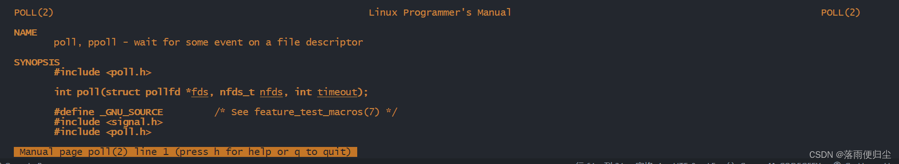

# IO多路复用 —— poll

## poll模型
### 前言
poll模型与select的实现原理相近，所以绝大数的原理其实可以参考select，我们这里对二者的相同点不做过多探究，如果有需要可以去看一下博主的上一篇文章：
[](/home/fengxu/thread/fengxu-blog/book/src/网络编程/chapter3.md)
这里我们只对二者的不同处做说明。

###  poll结构体

在poll模型中，是利用pollfd结构体数组来储存socket通讯中使用的socket，pollfd的结构体实现如下：

```cpp
struct pollfd
{
    int fd; //存储的socket
    short events; // socket触发的事件
    short revents; // 返回的事件
}
```

由于poll使用的是结构体数组，所以相比于select,poll没有1024的数量限制。

### poll模型存在的问题与一些细节

- 在程序中，poll'的数据结构是数组，传入内核里面切换为链表
- 每次调用select()需要拷贝两次bitmap，poll拷贝一次结构体数组
- poll监视的连接数没有1024的限制，但是随着socket的增多，poll的效率会降低

### poll流程图（这里以服务端监听socket为例,只有只读事件）


### 代码示例
- poll.h
```cpp
#include "data-sharing-center/public/_cmpublic.h"

int initsocket(int port);
```

- poll.cpp
```cpp
#include "poll.h"

using namespace std;

int main(int argc,char* argv[])
{
     if(argc!=2)
    {
        cout<<"using example:./server [port]"<<endl;
        return -1;
    }
    int listensock=initsocket(atoi(argv[1]));
    if(listensock<0)
    {
        perror("initsocket() error");
        return -1;
    }

    //定义poll模型的结构体数组
    struct pollfd fds[2048];   //这里写的数字仅说明可以超过1024，具体情况请根据实际情况来判断

    //初始化结构体数组
    for(int ii=0;ii<2048;ii++)
    {
        fds[ii].fd=-1;
        fds[ii].events=POLLIN;   //POLLIN:读,POLLOUT:写,POLLIN|POLLOUT:读写
    }

    int maxfd=listensock;

    while(true)
    {
        //开始监听
        int infds=poll(fds,maxfd+1,100); //最后的数字是超时机制所需的时间,单位为微秒

        if(infds<0)  //连接失败
        {
            perror("poll() error");
            break;
        }
        else if(infds==0)  //超时
        {
            cout<<"poll() timeout"<<endl;
            continue;
        }

        else  //有事件发生
        {
            for(int ii=0;ii<maxfd+1;ii++)  //遍历结构体数组，寻找发生事件的socket
            {
                if(fds[ii].fd==-1) continue;
                if((fds[ii].events&&POLLIN)==0) continue; //没有读事件
                if(fds[ii].fd==listensock)  // 有客户端发送了连接请求
                {
                    struct sockaddr_in clientaddr;
                    socklen_t len=sizeof(clientaddr);
                    int clientsock=accept(listensock,(struct sockaddr*)&clientaddr,&len);
                    if(clientsock<0)
                    {
                        perror("accept() error");
                        break;
                    }
                    cout<<"new client connect"<<endl;
                    //将新的socket加入到结构体数组中
                    fds[maxfd].fd=clientsock;
                    fds[maxfd].events=POLLIN;
                    if(maxfd<clientsock) maxfd=clientsock;
                }
                else
                {
                    //有客户端发送了数据
                    char buff[1024];
                    memset(buff,0,sizeof(buff));
                    int len=recv(fds[ii].fd,buff,sizeof(buff),0);
                    if(len<0)  //说明是客户端关闭了连接
                    {
                        close(fds[ii].fd);
                        fds[ii].fd=-1;
                        fds[ii].events=0;
                        if(fds[ii].fd==maxfd)
                        {
                            for(int ii=maxfd;ii>0;ii--)
                            {
                                if(fds[ii].fd!=-1)
                                {
                                    maxfd=ii;
                                    break;
                                }
                            }
                        }
                    }
                    cout<<"recv data:"<<buff<<endl;
                    //将数据原封不动的发送给客户端
                    send(fds[ii].fd,buff,len,0);
                }
            }
        }
    }
    return 0;
}


int inintsocket(int port)
{
    int sock=socket(AF_INET,SOCK_STREAM,0);
    if(sock<0)
    {
        perror("socket() error");
        return -1;
    }

    //设置端口复用
    int opt=1;
    unsigned int len=sizeof(opt);
    setsockopt(sock,SOL_SOCKET,SO_REUSEADDR,&opt,len);

    //绑定端口
    struct sockaddr_in serveraddr;
    serveraddr.sin_family=AF_INET;
    serveraddr.sin_port=htons(port);
    serveraddr.sin_addr.s_addr=htonl(INADDR_ANY);

    if(bind(sock,(struct sockaddr*)&serveraddr,sizeof(serveraddr))<0)
    {
        perror("bind() error");
        close(sock);
        return -1;
    }

    //监听
    if(listen(sock,5)<0)
    {
        perror("listen() error");
        close(sock);
        return -1;
    }

    return sock;

}
```

注意: 这里的头文件是博主自己封装的，大家可以使用’man+函数名的方式查看相关函数所需的头文件以及其帮助文档,示例：


